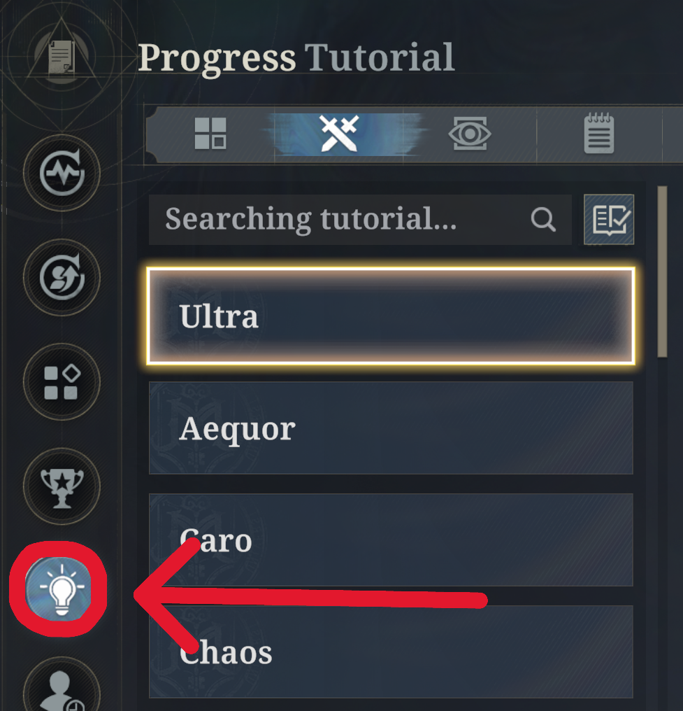
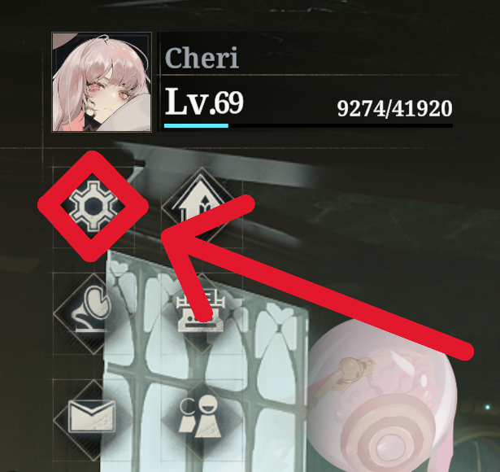
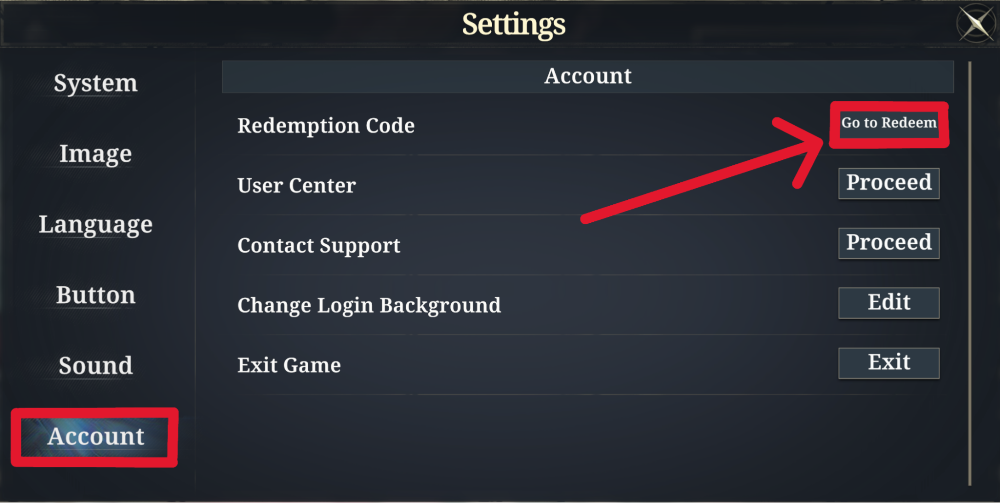
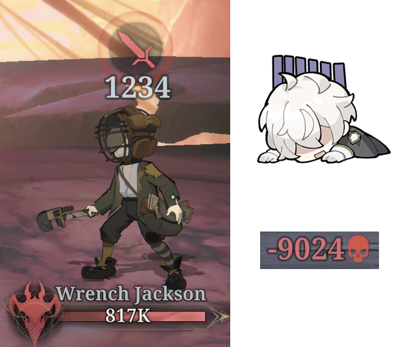

<figure markdown="span">
  
</figure>

<h1 class="text-center" style="margin: 0; font-size: 3em;">
  Morimens New Player Handbook
</h1>

  By Cheri, with help from the Morimens EN Discord and Mythag University

  "May the Silver Key guide your way"

!!! note "Last updated"

    21 May 2026

    V2.5.1.0 2.5th Anniversary

!!! info ""

    This is a living document. All info is subject to change.
    
    Let me know on [Discord](https://discord.com/channels/1131791637933199470/1477730088299663431){target="_blank"}, if you have any feedback or suggestions!

## Welcome to Morimens!

This guide is aimed at new players who are just starting the game. You can use it as a quick reference for common questions. It also contains advice about game strategy and how to spend your resources.

This info is based on my experience as a veteran player and speedrunner, as well as the opinions of top players in the EN community. No advice is perfect, however I have tried to make this guide as unbiased and complete as possible.

Thanks to the following players for their feedback: Alice, angbak, Arandomflamev2, Aria, Arintal, Aurora, Bagels, Blecnes, Bluelien, Calliphora, Catato, cornonthemacabre, dracozion, dudu, Ellie, Exo, Fibrinogen, fish, Frosthief, John Morimens, Jolly, Juice, Kaly, L, Lens, Lil poison bro, Megidola, Melwyn, Mengluo, Mika, monchi, Null, ppep, RainScarlet, Rascal, Redz, smile, Snorlax, Soma, Spooky, Tea, Villa, Zekiel, Zyocuh.

## Read the In-Game Tutorials

  {class="on-glb" loading=lazy}
  {class="on-glb" loading=lazy}
  {class="on-glb" loading=lazy}

A lot of information can be found in the in-game tutorials. Clicking on various icons in the UI will bring up information as well.

This guide assumes you have already read all of these things and understand:

- how the basic game mechanics work
- what arithmetica, aliemus, keyflare, exalts, and posses are
- what each of the stats does
- what each of the realms does
- how to use Aequor stances, Caro Crimson Furnace, and Ultra Annihilation

If you need further explanation for any of these, consult the [Mythag Compendium](https://docs.google.com/spreadsheets/d/1TCU7LJRzqKeuvLe97y_TfGZ-j6jq5bZX6hskAAJ2mFQ/edit?gid=508523868){target="_blank"}.

## Redemption Codes

  {class="on-glb" loading=lazy}
  {class="on-glb" loading=lazy}

Codes are often given out from social media promotions. You can redeem them for Silver and other rewards.

The best way to learn what codes are currently active is to ask in the [official Discord](https://discord.gg/RAegY8wcGx){target="_blank"}.

## You Will Die

<figure markdown="span">
  {width="400" loading=lazy}
</figure>

As a new player, you start in a honeymoon period. Chapters 1-5 of Faded Legacy are relatively easy and can be beaten with random characters playing random cards.

Once you reach the midgame, Morimens stops holding your hand. Enemies will no longer roll over to basic attacks. You will see incoming damage that is higher than your whole HP bar. You will probably die the first time you attempt many bosses.

Treat each defeat as a lesson rather than a setback. This game is 10% pay-to-win and 90% skill and patience. If you spend thousands of dollars on a bad team, you will still die. If you pay attention, build your team right, and play your cards right, you'll overcome challenges that seem impossible.

One more thing: there's no shame in using Emergency Gnosis. The game gives you a free revive every day. Unless you're aiming for achievements or bragging rights, why waste it?
