# Spending Your Resources

<figure markdown="span">
  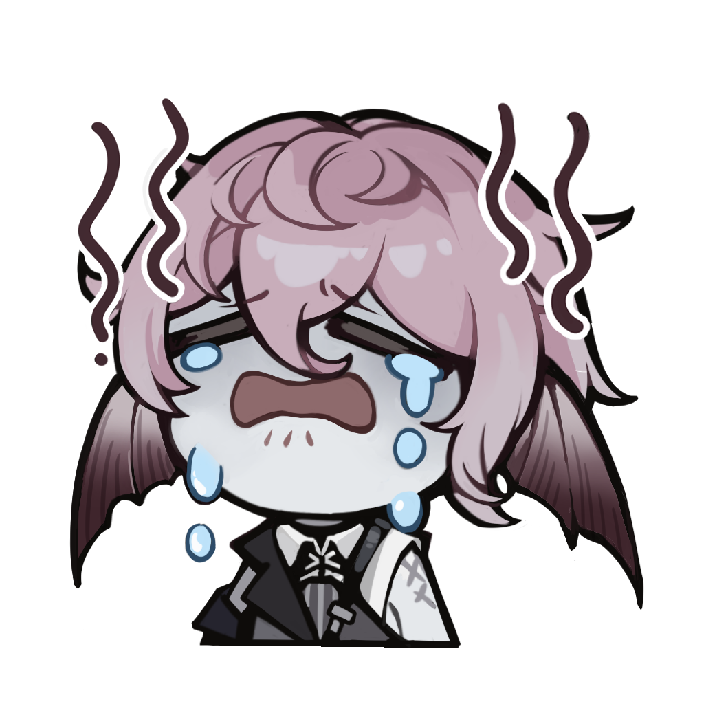{width="128"} <figcaption>Caecus wasted all his Rose Scrip and is now broke. Don't be like Caecus.</figcaption>
</figure>

## Your First Awakening

After completing the prologue, you get a free 5-pull where you can choose any SSR awakener from the standard banner. Here are the options:

<ul class="gallery" markdown="block">
  <li markdown="span" style="background-color: var(--md-realms-chaos)">
    {width="96"}
    
Chaos

  </li>
  <li markdown="span">
    {width="96"}
    
Nymphaea

  </li>
  <li markdown="span">
    {width="96"}
    
Alva

  </li>
  <li markdown="span">
    {width="96"}
    
Pandia

  </li>
  <li markdown="span">
    {width="96"}
    
Nautila

  </li>
  <li markdown="span">
    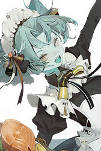{width="96"}
    
Karen

  </li>
</ul>

<ul class="gallery" markdown="block">
  <li markdown="span" style="background-color: var(--md-realms-aequor)">
    {width="96" loading="lazy"}
    
Aequor

  </li>
  <li markdown="span">
    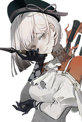{width="96" loading="lazy"}
    
Sanga

  </li>
  <li markdown="span">
    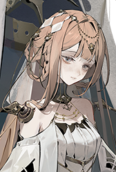{width="96" loading="lazy"}
    
Celeste

  </li>
  <li markdown="span">
    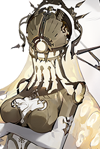{width="96" loading="lazy"}
    
Faros

  </li>
  <li markdown="span">
    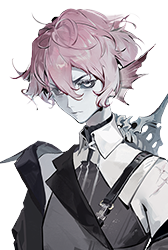{width="96" loading="lazy"}
    
Caecus

  </li>
  <li markdown="span">
    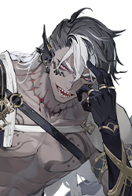{width="96" loading="lazy"}
    
Goliath

  </li>
</ul>

<ul class="gallery" markdown="block">
  <li markdown="span" style="background-color: var(--md-realms-caro)">
    {width="96" loading="lazy"}
    
Caro

  </li>
  <li markdown="span">
    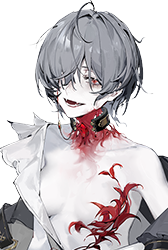{width="96" loading="lazy"}
    
Leigh

  </li>
  <li markdown="span">
    {width="96" loading="lazy"}
    
Faint

  </li>
  <li markdown="span">
    {width="96" loading="lazy"}
    
Helot

  </li>
  <li markdown="span">
    {width="96" loading="lazy"}
    
Agrippa

  </li>
  <li markdown="span">
    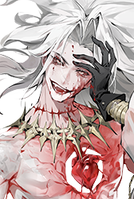{width="96" loading="lazy"}
    
Uvhash

  </li>
</ul>

<ul class="gallery" markdown="block">
  <li markdown="span" style="background-color: var(--md-realms-ultra)">
    {width="96" loading="lazy"}
    
Ultra

  </li>
  <li markdown="span">
    {width="96" loading="lazy"}
    
Casiah

  </li>
  <li markdown="span">
    {width="96" loading="lazy"}
    
Jenkin

  </li>
  <li markdown="span">
    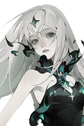{width="96" loading="lazy"}
    
Liz

  </li>
  <li markdown="span">
    {width="96" loading="lazy"}
    
Tinct

  </li>
  <li markdown="span">
    {width="96" loading="lazy"}
    
Winkle

  </li>
</ul>

My advice: **Pick whoever you think is cool.**

You get standard pulls like water in this game, and you get standard characters when you miss on a limited banner, so you are going to own all of these characters eventually.

All the standard characters are equally good and usable in some way, from early game all the way to endgame. (The only exceptions are Pandia and Uvhash, who are still usable at endgame, just not as good as the others.)

You will probably have more fun doing the story mode with a character you like, rather than a character who is 5% stronger but you don't care much about.

If you *only* care about meta, go to the [official Discord](https://discord.gg/RAegY8wcGx) and ask what standard characters work best with the current rate-up limited characters.

## Should I Reroll My Account?

**No, rerolling is a waste of time.**

Keeper level (account level) is the most valuable stat in this game. Everything else can be fixed with patience or money, but there's no way to get a high keeper level other than sticking to one account for a long time.

Unless you spend 500K silver pulling wheels you don't use, or something similarly ridiculous, it is very difficult to brick your account. You don't need meta characters to clear normal story mode or even get all rewards from D-Effect Zone.

Even if you want meta characters, Morimens is one of the most generous gacha games in existence. Just wait for the developers to give you free pulls, and then you can go pull on whatever banner you want.

<figure markdown="span">
  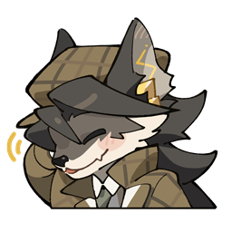{width="128" loading=lazy} <figcaption>"99% of gamblers quit before they hit the jackpot."</figcaption>
</figure>

## What Banner Should I Pull?

### Luminous and Ethereal Cores (Limited Pulls)

{width="128" loading=lazy}
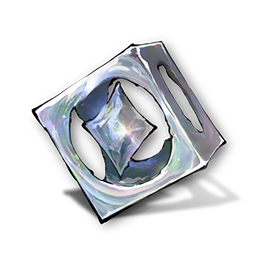{width="128" loading=lazy}

{width="384" loading=lazy}

**Use Silver to buy Luminous Cores. Spend Luminous Cores and Ethereal Cores to pull for limited characters.**

In general, limited characters are more flexible and powerful than standard characters. As a new player with a fresh account, the fastest way to clear harder stages and get more rewards is to pick one or more of the currently running limited characters to focus on.

**You can skip limited Wheels of Destiny if you need to save pulls.** This is because characters don't need their own wheel to function. You can substitute with standard SSR wheels, or even lower-rarity wheels, and it will be enough to clear all content in the game. Sometimes the substitute is more powerful than the character's own wheel.

This guide includes Awakener Tier Lists and an SSR Wheel Tier List. The higher tier an awakener or wheel is, the more recommended it is for new players to pull for.

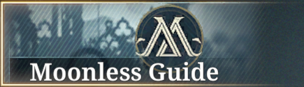{width="384" loading=lazy}

The Moonless Guide banner lets you select 4 limited characters from the first year of Morimens. To summarize this guide's Awakener Tier Lists:

- Thais and Horla are very powerful and highly recommended for new players.
- Lily, Ryker, Tawil, Miryam, Murphy, GHelot, and Salvador are strong choices.
- "24", Hameln, and Tulu are okay but not amazing choices.
- Sorel, Daffodil, and Wanda aren't worth it for new players unless you really like them.

Once you hit a recommended stopping point for any of the selected characters, this banner is no longer worth pulling on because of the risk of getting useless dupes, and you should spend your pulls on the dedicated rate-up banners instead.

### Pure Cores (Standard Pulls)

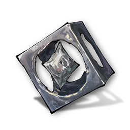{width="128" loading=lazy}

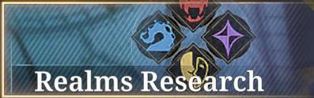{width="384" loading=lazy}

**Use your Pure Cores to pull for all the realms in Realms Research and get lots of characters to build teams with.**

You need at least 2 characters from each realm to complete Lightless Realm and event achievements. You also need 5 teams if you don't want to miss seasonal rewards from D-Effect Zone (for a total of 19 characters + 1 borrowed support). You don't need strong teams to clear the lowest difficulty — you just need enough characters.

Morimens is a deckbuilding game. All the standard characters in this game are useful in some way. If you have problems clearing a stage, the solution is often to change your team comp. You can't do this if you have no characters.

**Aim for characters that work well with the limited character(s) you pulled for.** The Awakener Guides section has an overview of what each character does and what teammates they might want.

**Don't focus on enlightens for standard characters as a new player.** If you have problems clearing normal story stages, learning the boss mechanics and having other characters to swap in is much more important than having E2 Goliath or E3 Caecus.

!!! info ""
    {width="88.4833" loading=lazy}
    {width="384" loading=lazy}

    Ramona: Timeworn (GRamona) is an alternate form of Ramona with different abilities. If you want her, she costs 60 Pure Cores to unlock. You also need to unlock and complete her Psyche Deepdive side story, "One Step Away."

{width="384" loading=lazy}

**If you have enough characters, you can pull for wheels in Wheels of Rotation.** The Awakener Guides section has suggested SSR wheels for each character. The SSR Wheel Tier List tells you which wheels are generally useful in many teams. Start by getting E3 of every wheel you plan to use in your main team.

**If you already did all of the above and don't know what to pull next**, you can:

- Get any standard character enlightens you are missing.
- Unlock Gnostic Potential for your standard characters.
- Pull on the standard character banner to fish for limited characters and +12 standards.
- Go to "wheel jail" and try to +12 a wheel. You can equip two SSR wheels at once if one of them is at +12. Blade of the Titan (Goliath's SSR wheel) is a good candidate to +12.

## Spending Menophin (Stamina)

### Events

<figure markdown="span">
  {width="400" loading=lazy}
</figure>

**Spend your menophin on limited-time events.** There is usually an ongoing event with stages that cost menophin to challenge. Once you do the achievements and get the SR wheel from the event, the rewards are the same as interludes or better. If you own the associated limited character or their SSR wheel, you get even more bonus rewards.

**After fully unlocking the event, don't be afraid to use Special Potion Supply** *(stamina refills)*. As a new player, getting keeper level XP and level up materials *right now* is probably more worthwhile than whatever you are saving for in the future.

**You can do the highest difficulty and get maximum rewards.** Unlike interludes, events are not gated by keeper level. The highest difficulties can easily be beaten by borrowing a level 90 Mouchette from the leaderboards (See [How to clear event lvl 60 stages at lvl 1](https://www.reddit.com/r/Morimens/comments/1shmgbs/how_to_clear_event_lvl_60_stages_at_level_1/?utm_source=share&utm_medium=web3x&utm_name=web3xcss&utm_term=1&utm_content=share_button){target="_blank"}).

<figure markdown="span">
  {width="600" loading=lazy} <figcaption>A maxed out Mouchette easily clears Madness difficulty by herself</figcaption>
</figure>

After you clear a stage once, you can re-enact it to instantly get rewards. As a new player, it's worth it to spend a few Emergency Gnoses to clear the level 60 stages, so you get all achievements and huge value for your menophin for the next 2 weeks.

### Interludes

{width="384" loading=lazy}

Sometimes you're unlucky and can't get a specific resource you need from events. In that case, you can farm interludes instead. Try not to do this unless you're desperate.

### Verboten Covenant

{width="384" loading=lazy}

**When you unlock covenants at Keeper Level 25, spend some menophin to outfit your characters.** Event stages never give covenants. The only way to get certain covenants, like Burial Ground's Sighs or Life Drain, is to spend menophin doing Verboten Covenant interludes.

**Don't worry about substats as a new player.** Rolling for substats is incredibly expensive and best left for endgame when you have nothing else to spend Rose Scrip on. For now, focus on getting a 6-piece set for each covenant set you plan to use.

The Awakener Guides section suggests covenants for each character. The Building Covenants section suggests main stats and substats to aim for.

## Upgrading Characters

### Levels

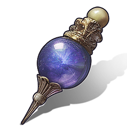{width="80" loading=lazy}
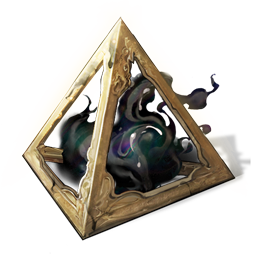{width="80" loading=lazy}
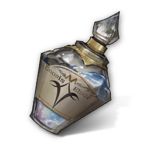{width="80" loading=lazy}
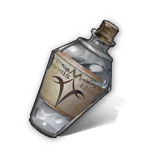{width="80" loading=lazy}
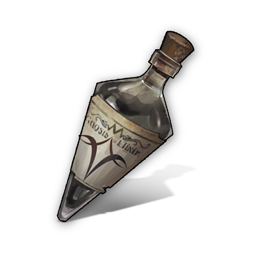{width="80" loading=lazy}

**Raise everyone to at least level 60.** This increases their CON and thus your max HP. You also unlock milestones in the Records for having level 60 characters. Level 60 is cheap to reach if you [farm limited-time events](#events).

**Prioritize damage dealers and shielders** — characters where the numbers matter. ATK and DEF only affect the numbers on an awakener's command cards and exalt. For a character like Aigis, her debuffs are the same at level 1 or level 90, so leveling her up has less of an impact than leveling up your main damage dealer.

### Skills

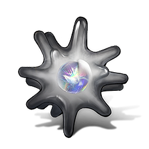{width="80" loading=lazy}
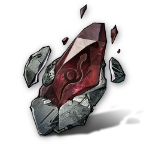{width="80" loading=lazy}
{width="80" loading=lazy}
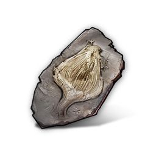{width="80" loading=lazy}
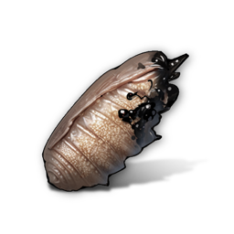{width="80" loading=lazy}
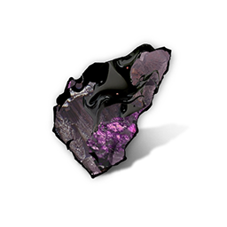{width="80" loading=lazy}

**Raise all cards to at least level 3.**

**Prioritize skills where the numbers matter.** For example, leveling up Lotan's rouse only increases the amount of aliemus you get from the rouse — a bonus you only get once per fight. In contrast, leveling up her exalt increases the damage of her highest-damage skill, and the rate at which it scales up over time, and the damage and aliemus from the generated strikes at E3.

**Don't neglect strikes and defenses.** These cards give more aliemus when upgraded, which is important for all characters.

### Soulforge Aptitude

{width="384" loading=lazy}

{width="80" loading=lazy}
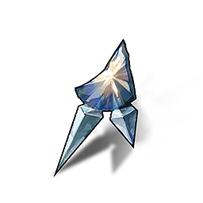{width="80" loading=lazy}

**Very important to level up in Astral Reign.**

Each soulforge level increases CON, ATK, and DEF by 3% in Astral Reign stages. This is like adding 5 extra character levels per soulforge level.

**At minimum, get soulforge level 1 on everyone.** This unlocks their Soulforge Aptitude talent, which in most cases is like a free enlighten. If you don't have any soulforge levels on a character, you're missing part of their kit in Astral Reign stages.

### Madness Omen

{width="384" loading=lazy}

**Ignore this until you run out of other things to upgrade.**

This talent is super expensive to unlock. The only thing it does is make the character start the stage with 5 more aliemus per level.

It's useful on some characters who need to exalt in the first fight (e.g. Aigis), but you don't have to worry about it as a new player.

### Gnostic Potential

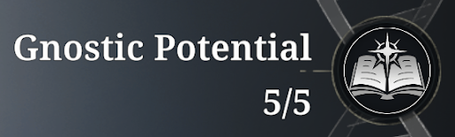{width="384" loading=lazy}

**Ignore this until you run out of other things to spend Pure Cores on.**

This talent grants a decent stat boost, but it's very expensive to unlock. Leave it until you've already pulled a lot and you already have all the standard characters and wheels you want.

## Mythag Shop Priority List

### Rose Scrip

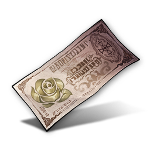{width="128" loading=lazy}

{width="80" loading=lazy}
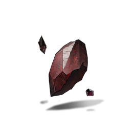{width="80" loading=lazy}

**Buy Mimetic Crystals and Aetheric Shards every day.** These are rare time-gated materials.

**Buy whatever else you need.** This is a good place to get XP potions and low-level skill materials.

**Don't refresh the shop.** You need tens of millions of Rose Scrip to upgrade all your characters, and even more to upgrade your covenants at endgame.

### Sediment

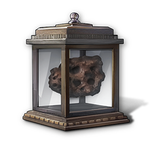{width="128" loading=lazy}

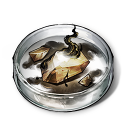{width="80" loading=lazy}
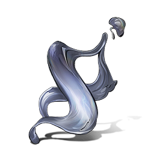{width="80" loading=lazy}

**Buy Prototype Horizon and Timeloop Copy every month.** These give 1 free duplicate of any awakener or wheel you own, including limited ones. This means Prototype Horizon is worth ~42 limited pulls and Timeloop Copy is worth ~33 limited pulls.

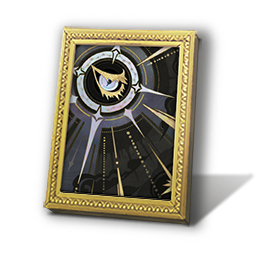{width="80" loading=lazy}

**Buy as many copies of Dusk and Dawn as possible.** This is one of the best wheels in the game and it can only be obtained here. If you have it at +12, you can equip it at the same time as another SSR wheel.

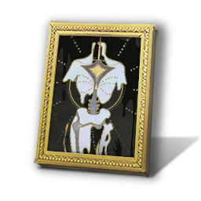{width="80" loading=lazy}
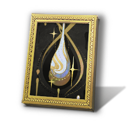{width="80" loading=lazy}
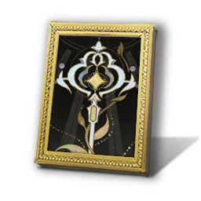{width="80" loading=lazy}

**If you bought the Extra Curriculum *(Battle Pass)*, buy wheel dupes here too.**

{width="80" loading=lazy}
{width="80" loading=lazy}
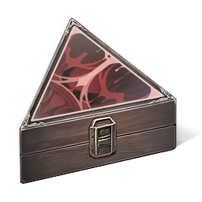{width="80" loading=lazy}
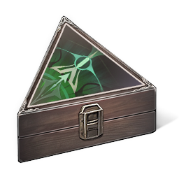{width="80" loading=lazy}

If you have leftover Sediment each month, you can buy other stuff like Mimetic Crystals, Luminous Cores, or covenants. Pure Cores aren't really worth it since you get a lot from dailies.

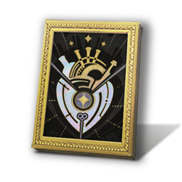{width="80" loading=lazy}

If you don't have enough keyflare wheels for D-Effect Zone, you can get one copy of Heart of Silver. It's a good candidate to +12 if you're done with the wheels above.

### Badges

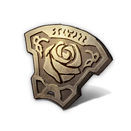{width="128" loading=lazy}

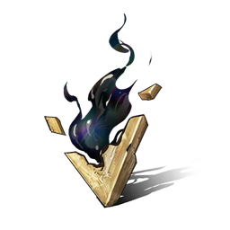{width="80" loading=lazy}

**Buy Gnosis Fragments every month.** These are rare time-gated materials.

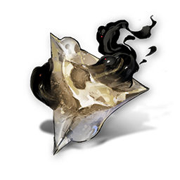{width="80" loading=lazy}
{width="80" loading=lazy}
{width="80" loading=lazy}

**Buy shards for Lotan, Ogier, and Doll.** All of these characters are usable in D-Effect Zone. Better to have them at OE and not need them, than realize you need OE Lotan and can't get her because you can only buy 3 shards per month.

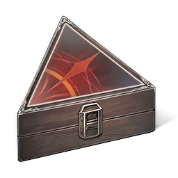{width="80" loading=lazy}
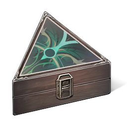{width="80" loading=lazy}
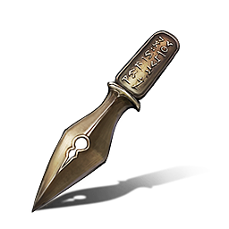{width="80" loading=lazy}

If you have leftover Badges each month, you can spend them to buy covenants or Remembrance Quills (pens). Keep in mind that it's hard to get Badges after you finish the story.

{width="80" loading=lazy}
{width="80" loading=lazy}

You can get the Luminous Cores and Pure Cores if you want. These are one-time only and don't refresh.

### Lightless

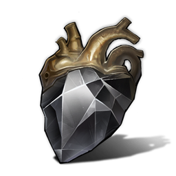{width="128" loading=lazy}

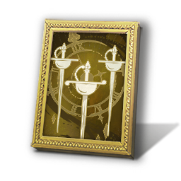{width="80" loading=lazy}

**Buy as many copies of Rewinding Time as possible.** This is a strong wheel for many characters and it can only be obtained here. If you have it at +12, you can equip it at the same time as another SSR wheel.

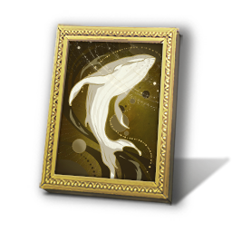{width="80" loading=lazy}
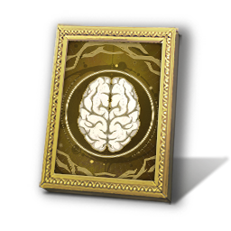{width="80" loading=lazy}

**Buy Celestial Beast or Deathless Ascent with extra Black Offerings.** They're good targets to +12 once you have Rewinding Time at +12.

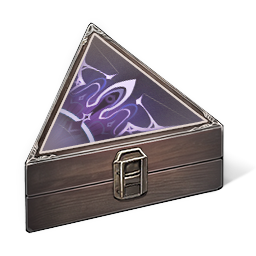{width="80" loading=lazy}

Feast from Afar is a meta covenant set for some characters. It can only be obtained here.

{width="80" loading=lazy}
{width="80" loading=lazy}

You can get the Luminous Cores and Pure Cores if you want. These are one-time only and don't refresh.

{width="80" loading=lazy}

You can buy SR wheels if you want. Gateway of Truth is very good and worth getting to +12. However, you get them for free if their event reruns in the future.

### D-Jewels

{width="128" loading=lazy}

{width="80" loading=lazy}
{width="80" loading=lazy}

**Buy Dreamshards and Dreamsparks every week.** These are important upgrade materials for Astral Reign stages. After you finish the story, you can only get them from events and the shop.

{width="80" loading=lazy}

**Buy Mimetic Crystals every week.** These are rare time-gated materials.

{width="80" loading=lazy}

**Buy a shard for Aigis if you have leftover D-Jewels.** She is one of the best characters in the game and worth getting to OE. You can also buy shards for Aurita or Erica if you want.

{width="80" loading=lazy}
{width="80" loading=lazy}

Core Meltdown and Winter's Requiem are useful wheels for D-Effect Zone. If you don't have enough keyflare wheels, you can get one copy of each.

{width="80" loading=lazy}
{width="80" loading=lazy}

You can get the Luminous Cores and Pure Cores if you want. These are one-time only and don't refresh.

{width="80" loading=lazy}
{width="80" loading=lazy}

The covenants Cursed Rabbit and Re-evolution are niche but used by some builds. You can buy them if you want. Keep in mind that you're delaying your long-term progression if you don't buy the highlighted materials above.

## Protoparadises & Selectors

{width="80" loading=lazy}

**Save your Protoparadises until you know exactly what you want.**

You get a lot of Pure Cores from the main story and new player rewards. You will probably pull dozens of standard characters in the first week of playing. Do you really need a specific character right away to clear normal story mode?

Use your Protoparadise if you've already pulled a lot and have most of the characters, but you're still missing a specific character you want. Or if you're missing a specific enlighten that you're 100% sure will help you clear a specific stage.

If you use your Protoparadise on a character and pull the same character soon after, it will be a huge waste.

{width="80" loading=lazy}

**Use Books of Rotation to get Blade of the Titan or whatever wheel you want.**

The standard wheel banner lets you pick a target, so if you regret your decision, correcting it is at most 90 Pure Cores away.

{width="80" loading=lazy}
{width="80" loading=lazy}

Sepirot and Fated Captures (obtained by spending real money) are random selectors. Just use them and see what you get.

{width="80" loading=lazy}
{width="80" loading=lazy}
{width="80" loading=lazy}
{width="80" loading=lazy}
{width="80" loading=lazy}
{width="80" loading=lazy}
{width="80" loading=lazy}
{width="80" loading=lazy}

If you spend a LOT of money, you can get limited character and wheel selectors. To decide what to get, you can check this guide's Awakener Tier Lists and SSR Wheel Tier List. You can also look at tier lists for heavy investment, like [monchi's +4 tier list](https://www.reddit.com/r/Morimens/comments/1sedg6e/morimens_tier_list_400_dtide_4_vortice_version/).

## Reality Verges

{width="128" loading=lazy}

Completing dailies gives you Reality Verges, which are used to unlock side stories and stories from past events.

**Use these to unlock posses.** Each Psyche Deepdive, Dreamscape, and Special Ops gives you a posse. Unlocking more posses boosts the power of all posses and relics in Astral Reign stages.

The Awakener Guides section suggests a posse that works well with each DPS.

**Remember that events can rerun.** If an event reruns, you unlock the event story for free.

If you have all the posses, you can use Reality Verges to unlock whatever you want. You can consider unlocking all the Reproduction Frenzies, as each gives 1 Pure Core (standard pull).

## Silver Prime *(Real Money)*

{width="128" loading=lazy}

{width="384" loading=lazy}

**Moonphase Vigil** (the monthly login bonus) gives the most pulls per Silver Prime spent.

{width="384" loading=lazy}

**Extra Curriculum** (the seasonal Battle Pass) gives fewer pulls, but a lot of materials for leveling up characters, including time-gated materials. It also lets you pick 1 of 3 SSR wheels which are all incredibly powerful. After you get a wheel once, you can buy dupes from the Sediment shop.

{width="384" loading=lazy}

**Preorders** are time-limited packages that sometimes appear before a new character is released. These cost 1980 Silver Prime and give 130 pulls, plus a Prototype Horizon and Timeloop Copy. These are the second highest value for your money after Moonphase Vigil.

{width="384" loading=lazy}

If you still want to spend money on the game, you can buy the time-limited Promotion Commemorative Gifts and Echoed Pilgrimage packs, or the various gift boxes from the Store.

<figure markdown="span">
  {width="128" loading=lazy} <figcaption>Thank you for supporting the game!</figcaption>
</figure>
